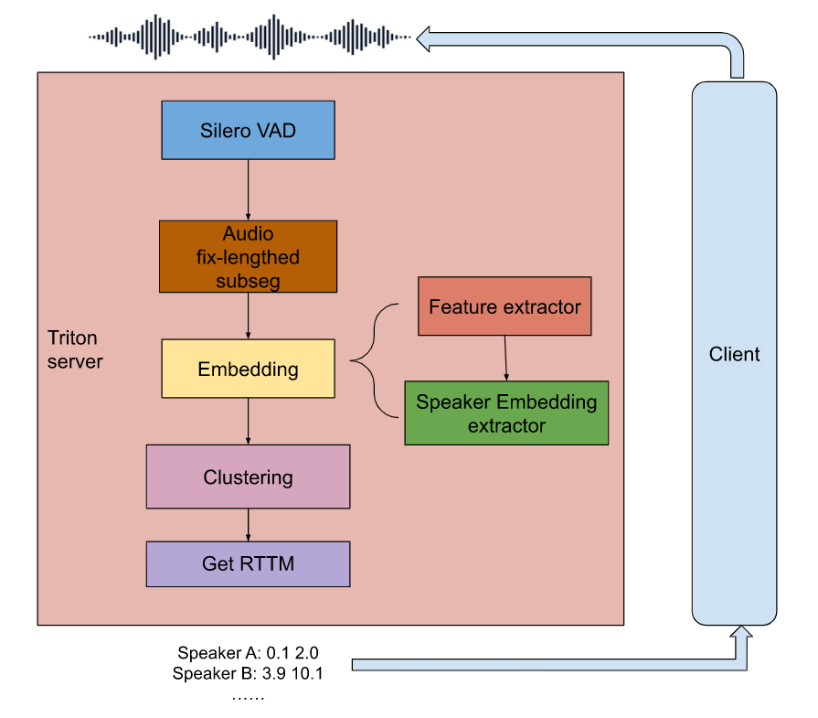

# Best Practice for Deploying a WeSpeaker diarization service using Triton

In this best practice, we'll go through how to deploy a WeSpeaker diarization pipeline in GPU by using NVIDIA [Triton Inference Server](https://github.com/triton-inference-server/server), which contains several modules including SAD, Speaker Embedding Extraction, Clustering and etc.

We will use [Triton Business Logic Scripting](https://github.com/triton-inference-server/python_backend#business-logic-scripting) (BLS) to implement this pipeline.

## Table of Contents

- [Preparation](#preparation)
  - [Prepare Environment](#prepare-environment)
  - [Prepare Models](#prepare-models)
  - [Preapare Test Data](#prepare-test-data)
- [Triton Inference Server](#triton-inference-server)
  - [Quick Start](#quick-start)
  - [Business Logic Scripting](#bls)
- [Inference Client](#inference-client)
  - [Quick Start](#quick-start-1)
  - [Compute Metrics](#compute-metrics)
- [Benchmark](#benchmark)


## Preparation

Let's prepare enrivonments, models and data first.

### Prepare Environment

Clone the repository:

```bash
# Clond WeSpeaker repo
git clone https://github.com/wenet-e2e/wespeaker.git
export WeSpeaker=$PWD/wespeaker/
cd runtime/server/diarization_gpu
export PROJECT_DIR=$PWD

```

### Prepare Models

To depoloy this pipeline, first we should obtain SAD and Speaker models.

#### Speaker Models

You can refer to [voxceleb sv recipe](https://github.com/wenet-e2e/wespeaker/tree/master/examples/voxceleb/v2) to train a WeSpeaker model or use a pre-trained model:

```bash
export SPK_MODEL_DIR=/workspace/pretrained_models
mkdir -p ${SPK_MODEL_DIR}
wget -c https://wespeaker-1256283475.cos.ap-shanghai.myqcloud.com/models/voxceleb/voxceleb_resnet34_LM.onnx -O ${SPK_MODEL_DIR}/voxceleb_resnet34_LM.onnx
```

Then you can follow the best practice of [GPU deployment](https://github.com/wenet-e2e/wespeaker/tree/master/runtime/server/x86_gpu) to deploy the WeSpeaker model in Triton.
After that, speaker models will be avaliable in `wespeaker/runtime/server/x86_gpu/model_repo/` directory.

```bash
export SPK_MODEL_REPO="wespeaker/runtime/server/x86_gpu/model_repo/"
```

#### SAD Models

Speaker activity detection model: system SAD (VAD model pretrained by [silero](https://github.com/snakers4/silero-vad)).

```bash
export SAD_DIR=/workspace/SAD
wget -c https://github.com/snakers4/silero-vad/archive/refs/tags/v3.1.zip -O external_tools/silero-vad-v3.1.zip
unzip -o external_tools/silero-vad-v3.1.zip -d external_tools
cp external_tools/silero-vad-3.1/files/silero_vad.jit $SAD_DIR/
```

### Prepare Test Data

You can use the following command to access the evluation datas from voxconverse:

```bash
bash $WeSpeaker/examples/voxconverse/v1/run.sh --stage 2 --stop_stage 2
```

If you are using your own data, you can evaluate the audio one by one. Or you should preapre a `wav.scp`, which contains a list of audios. For example,

```
abjxc abjxc.wav
afjiv afjiv.wav
```

## Triton Inference Server

[Triton Inference Server](https://github.com/triton-inference-server/server) can help with the most of serving work for us and handles requests/results sending and receiving, request scheduling, load balance, and inference execution.  In this section, we will use Triton to depoy the diarization pipeline.



Build the server docker image:
```
docker build . -f Dockerfile/dockerfile.server -t wespeaker_server:latest --network host
```

You can also directly use the pre-built image:
```
docker pull wd929/wespeaker_server:v1
```

Build the client docker image:
```
docker build . -f Dockerfile/dockerfile.client -t wespeaker_client:latest --network host
```

Run the following commands to put the pretrained SAD and Speaker models into current `model_repo` directory.

```bash
cd ${PROJECT_DIR}
mkdir -p model_repo/run/1
cp -r $SPK_MODEL_REPO/* model_repo/

```

### Quick Start

Now start server:

```bash
# Start the docker container
docker run --gpus all -v $PWD/model_repo:/workspace/model_repo -v $SAD_DIR:/workspace/triton/ --shm-size=1g --ulimit memlock=-1 -p 8000:8000 -p 8001:8001 -p 8002:8002 --ulimit stack=67108864 -it  wespeaker_server:latest

# Inside the docker container
tritonserver --model-repository=/workspace/model_repo

```

### Business Logic Scripting

Business Logic Scripting (BLS) can execute inference requests on other models being served by Triton as a part of executing one Python model.


## Inference Client

In this section, we will show how to send requests to our deployed SD service, and receive the RTTM results.


### Quick Start

Run,

```bash
AUDIO_DATA=<path to your test wav files>
docker run -ti --net host -v $PWD/client:/ws/client -v $AUDIO_DATA:/ws/test_data  wespeaker_client:latest
cd /ws/client
```

In the docker container, run the client script to do the whole pipeline inference.

```bash
# Test one audio
export output_directory="output"
mkdir -p $output_directory
python client.py --url=localhost:8001 --audio_file=/ws/test_data/abjxc.wav --output_directory=$output_directory
cat $output_directory/rttm* > $output_directory/rttm
```

The above command sends a single audio `abjxc.wav` to the server and get the result. `--url` option specifies the IP and port of the server, in our example, we set the server and client on the same machine, therefore IP is `localhost`, and we use port `8001` since it is the default port for gRPC in Triton. But if your client is not on the same machine as the server, you should change this option.

You can also test specify the path of `wav.scp` with `--wavscp` option, then the client will test the audio files in the `wav.scp`.

```bash
# Test a bunch of audios
export wav_scp_dir=/ws/test_data
python client.py --url=localhost:8001 --wavscp=$wav_scp_dir/wav.scp --output_directory="outp"
cat $output_directory/rttm* > $output_directory/rttm
```

Finally, you can get the RTTM information in `$output_directory/rttm`.

### Compute Metrics

If you want to test the performances of our SD pipeline, you can run:

```bash
perl external_tools/SCTK-2.4.12/src/md-eval/md-eval.pl \
    -c 0.25 \
    -r <(cat data/voxconverse-master/dev/*.rttm) \
    -s $output_directory/rttm
```

## Benchmark (TODO)

